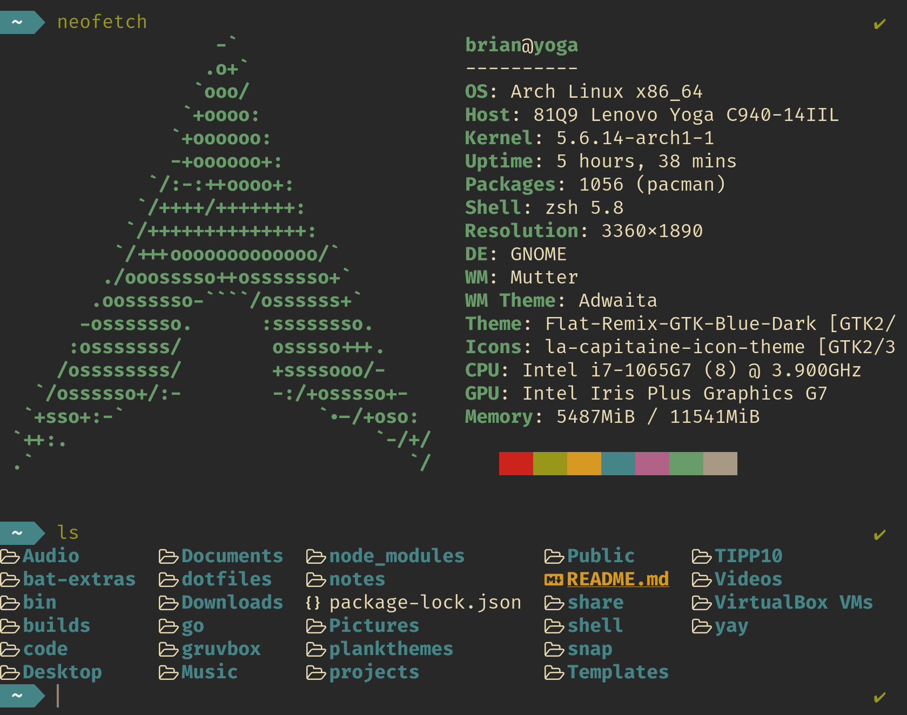

# Brian's dotfiles



## Installation

### Using yadm

This command downloads yadm and places it in your PATH. Yadm clone is the same as git clone except that it will ask you if you want to run the bootstrap script. If you do, make sure that you backup your existing dotfiles first. If you don't, yadm will still stash them and you can restore the stashed data by running `yadm stash apply` from within you `$HOME` directory.

```sh
sudo curl -fLo /usr/local/bin/yadm https://github.com/TheLocehiliosan/yadm/raw/master/yadm && sudo chmod a+x /usr/local/bin/yadm && yadm clone https://github.com/oberblastmeister/dotfiles.git
```
